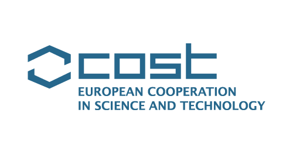

```{=html}
<main class="inner-page awards-projects-page">
  <section class="inner-section awards-section" id="awards">
    <div class="section-heading">
      <div>
        <h2>Awards</h2>
      </div>
    </div>

    <ul class="dated-list award-list">
      <li>
        <time datetime="2026">2026</time>
        <strong>National Award</strong>
        <p>Chinese Government Award for Outstanding Self-Financed Students Abroad</p>
      </li>
      <li>
        <time datetime="2026">2026</time>
        <strong>45th OMAE Outreach Scholarship</strong>
        <p>One of 11 doctoral recipients selected from more than 900 applicants.</p>
      </li>
      <li>
        <time datetime="2025">2025</time>
        <strong>National Scholarship</strong>
        <p>Financial Aid for Predoctoral Research Staff Supported by Santander Scholarship.</p>
      </li>
      <li>
        <time datetime="2024">2024</time>
        <strong>National Outstanding Thesis</strong>
        <p>Outstanding Thesis in Hydraulic Engineering Majors of National Higher Education Institutions in China.</p>
      </li>
      <li>
        <time datetime="2023">2023</time>
        <strong>National Scholarship</strong>
        <p>Spanish Government FPI Scholarship for Pre-doctoral researcher.</p>
      </li>
      <li>
        <time datetime="2023">2023</time>
        <strong>Excellent Thesis Postgraduate Award</strong>
        <p>Top 1%, Wuhan University of Technology.</p>
      </li>
      <li>
        <time datetime="2020">2020</time>
        <strong>Excellent Bachelor Award</strong>
        <p>Top 1%, Wuhan University of Technology.</p>
      </li>
      <li>
        <time datetime="2019">2019</time>
        <strong>National First-Level Award</strong>
        <p>8th China &amp; International Marine Vehicle Design and Construction Contest.</p>
      </li>
      <li>
        <time datetime="2018">2018</time>
        <strong>National Second-Level Award</strong>
        <p>7th China &amp; International Marine Vehicle Design and Construction Contest.</p>
      </li>
    </ul>
  </section>

  <section class="inner-section projects-section" id="projects">
    <div class="section-heading">
      <div>
        <h2>Projects and Fundings</h2>
      </div>
    </div>

    <div class="record-list project-record-list">
      <article class="academic-record project-record">
        <div class="record-date">2025 - 2028</div>
        <div class="record-body">
          <h3>RENEWFLOAT</h3>
          <p class="record-place">Lead Researcher <span>Spanish National Plan Funding</span></p>
          <p class="record-detail">Design of shared mooring and multi-use floating renewable platforms.</p>
          <p class="project-funding"><span class="record-label">Funder</span>Ministry of Science, Innovation and Universities of Spain</p>
          <p class="project-funding"><span class="record-label">Grant</span>PID2024-161775OB-C21 · €125,000</p>
        </div>
        
      </article>

      <article class="academic-record project-record">
        <div class="record-date">2026 - 2027</div>
        <div class="record-body">
          <h3>China–Spain Co-research Programme</h3>
          <p class="record-place">Spanish-side Lead Researcher <span>Shanghai Sci-tech Programme</span></p>
          <p class="record-detail">Hydrodynamic coupling and catch-escape mechanisms for fishing-gear mesh structures.</p>
          <p class="project-funding"><span class="record-label">Funder</span>Shanghai Municipal Government</p>
          <p class="project-funding"><span class="record-label">Grant</span>25HB2710100 · ¥400,000</p>
        </div>
        
      </article>

      <article class="academic-record project-record">
        <div class="record-date">2023 - 2025</div>
        <div class="record-body">
          <h3>UPM-FOWT-DAMP2</h3>
          <p class="record-place">Lead Researcher <span>Spanish National Plan Funding</span></p>
          <p class="record-detail">Hydrodynamics of motion-damping devices for floating offshore wind turbines through numerical modelling and small-scale experiments.</p>
          <p class="project-funding"><span class="record-label">Funder</span>Ministry of Science, Innovation and Universities of Spain</p>
          <p class="project-funding"><span class="record-label">Grant</span>PID2021-123437OB-C21 · €121,000</p>
        </div>
        
      </article>

      <article class="academic-record project-record">
        <div class="record-date">2024 - 2028</div>
        <div class="record-body">
          <h3>Decarbonising Waterborne Transportation (DeWaTra)</h3>
          <p class="record-place">Participant <span>European COST Action CA23159</span></p>
          <p class="record-detail">Working Group 4: renewable-energy contributions to ship energy efficiency.</p>
          <p class="project-funding"><span class="record-label">Funder</span>European Cooperation in Science and Technology</p>
        </div>
        
      </article>
    </div>
  </section>
</main>
```
