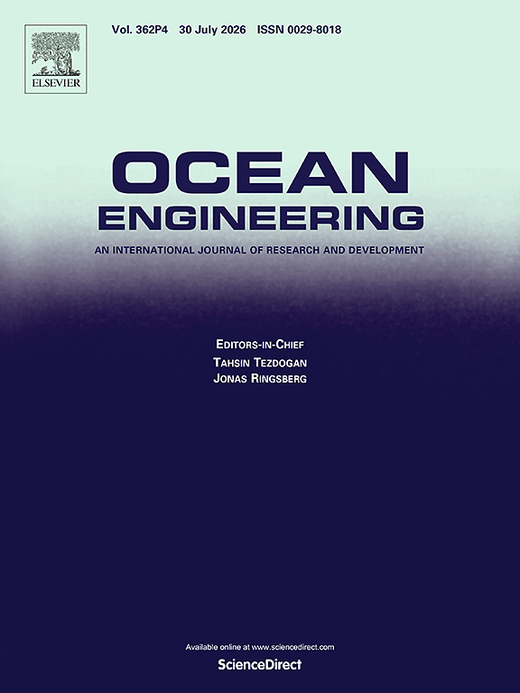
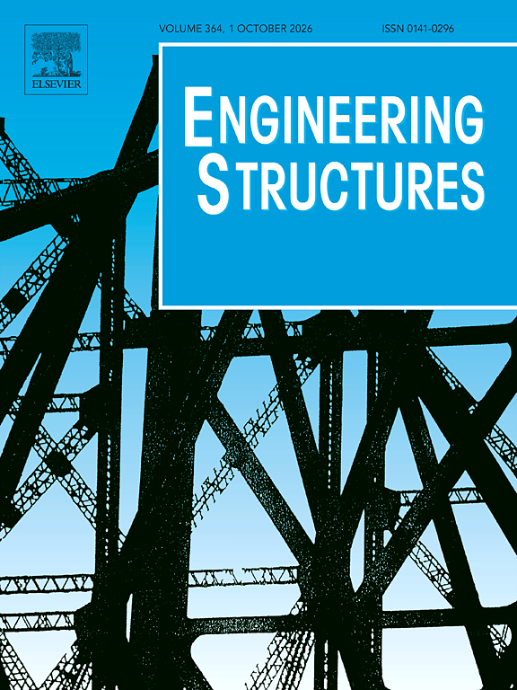
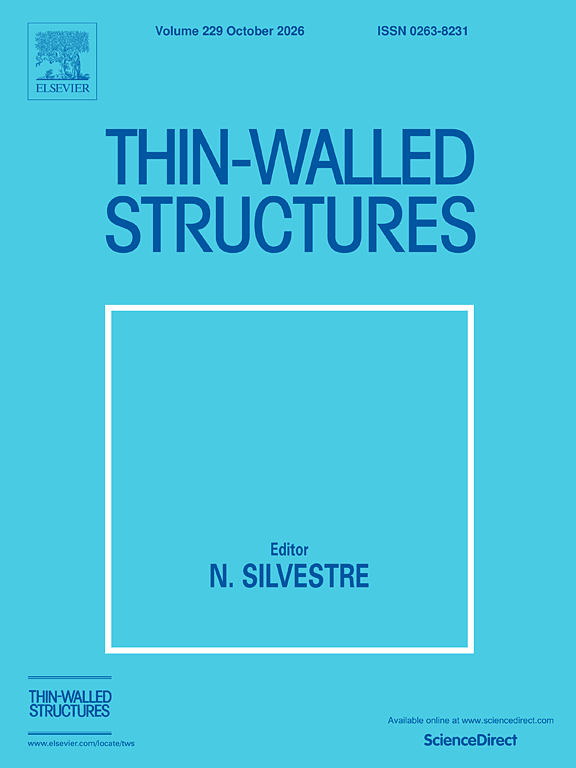

::: {.publications-page}

## Research profile

**13** published SCI journal articles, **8** of them as First/Corresponding Author (\*), **1** Highly Cited Paper
 
Google Scholar Citation: **289**; h-index=**8**; i10-index=6 (2026.07)

## Journal articles

  <figure class="journal-cover">
    
    <figcaption>Ocean Engineering</figcaption>
  </figure>
  <figure class="journal-cover">
    
    <figcaption>Applied Ocean Research</figcaption>
  </figure>
  <figure class="journal-cover">
    
    <figcaption>Engineering Structures</figcaption>
  </figure>
  <figure class="journal-cover">
    
    <figcaption>Thin Walled Structures</figcaption>
  </figure>

### 2026

13\. H. Peng, X. Li, **W. Z. Zhang\***, J. Pan, and P. Hu. "Physics-informed
   multi-layer perceptron (MLP) model with data augmentation for ship-bridge
   collision safety assessment." *Ocean Engineering* 362, 126339 (2026).
   [DOI](https://doi.org/10.1016/j.oceaneng.2026.126339)

12\. **W. Z. Zhang\***, Z. Jiang, J. Calderon-Sanchez, et al. "Wind-assisted
   propulsion systems for green shipping: A techno-economic review." *Ocean* 2
   (2026). [DOI](https://doi.org/10.26599/OCEAN.2026.9470019)

### 2025

11\. R. Haider, W. Shi, Z. Lin, Q. Xiao, **W. Z. Zhang**, and X. Li. "Dynamic
   response of floating offshore wind turbine to focused wave excitation."
   *Physics of Fluids* 37(8) (2025).
   [DOI](https://doi.org/10.1063/5.0279082)

10\. J. Pan, X. Y. Liu, **W. Z. Zhang**, and M. C. Xu. "Numerical study on the
   dynamical performance of multi-stable metamaterial structures under impact
   loading." *Ocean Engineering* 338, 121938 (2025).
   [DOI](https://doi.org/10.1016/j.oceaneng.2025.121938)

9\. M. Song, J. Chen, **W. Z. Zhang\***, J. Calderon-Sanchez, and Z. Y. Jiang.
   "Crashworthiness study of a monopile OWT with metamaterial-based fenders
   under vessel collisions." *Engineering Structures* 345, 121559 (2025).
   [DOI](https://doi.org/10.1016/j.engstruct.2025.121559)

8\. J. Tao, W. Chai, X. Yang, **W. Z. Zhang\***, C. Wang, and J. Qi. "Stability
   evaluation of a damaged ship with ice accumulation in arctic regions."
   *Journal of Marine Science and Engineering* 13(9), 1685 (2025).
   [DOI](https://doi.org/10.3390/jmse13091685)

7\. **W. Z. Zhang**, J. Pan, H. Peng, and M. C. Xu. "Reliability assessment of
   aged reinforced concrete bridge under ship impact considering multi-hazards."
   *Ocean Engineering* 326, 120772 (2025).
   [DOI](https://doi.org/10.1016/j.oceaneng.2025.120772)

6\. **W. Z. Zhang\***, J. Calderon-Sanchez, T. Almeida-Medina,
   A. Medina-Manuel, and A. Souto-Iglesias. "Numerical analysis of forced heave
   oscillations for an FOWT column with a heave plate using overset mesh."
   *Ocean Engineering* 341, 122736 (2025).
   [DOI](https://doi.org/10.1016/j.oceaneng.2025.122736)

### 2024

5\. **W. Z. Zhang**, J. Pan, J. Calderon-Sanchez, X. B. Li, and M. C. Xu.
   "Review on the protective technologies of bridge against vessel collision."
   *Thin-Walled Structures* 201, 112013 (2024).
   [DOI](https://doi.org/10.1016/j.tws.2024.112013)

4\. **W. Z. Zhang\***, J. Calderon-Sanchez, D. Duque, and A. Souto-Iglesias.
    "Computational Fluid Dynamics (CFD) applications in Floating Offshore Wind
    Turbine (FOWT) dynamics: A review." *Applied Ocean Research* 150, 104075
    (2024). **Highly Cited Paper.**
    [DOI](https://doi.org/10.1016/j.apor.2024.104075)

### 2023

3\. J. Pan, **W. Z. Zhang**, Z. M. Sun, X. Qu, and M. C. Xu. "Experimental
    study on the dynamical response of elastic trimaran model under slamming
    load." *Journal of Marine Science and Technology*, 1-16 (2023).
    [DOI](https://doi.org/10.1007/s00773-023-00969-y)

### 2022

2\. J. Pan, T. Wang, **W. Z. Zhang**, S. W. Huang, and M. C. Xu. "Study on the
    assessment of axial crushing force of bulbous bow for bridge against ship
    collision." *Ocean Engineering* 255, 111411 (2022).
    [DOI](https://doi.org/10.1016/j.oceaneng.2022.111411)

1\. M. C. Xu, Z. J. Song, T. Wang, **W. Z. Zhang**, and J. Pan. "Empirical
    formulae assessment of ultimate strength for perforated stiffened panels
    under longitudinal compression." *Ocean Engineering* 264, 112445 (2022).
    [DOI](https://doi.org/10.1016/j.oceaneng.2022.112445)

## Conference proceedings

4\. **W. Z. Zhang\***, J. Calderon-Sanchez, and A. Souto-Iglesias. "Influence
   of diameters in double heave plates on hydrodynamic coefficients under
   constant material usage." *International Conference on Offshore Mechanics
   and Arctic Engineering (OMAE 2026)*, ASME, 180583 (2026).

3\. C. Wang, J. Pan, **W. Z. Zhang**, and M. Xu. "Study on dynamical response
   of improved cylindrical shell chain structure under impact load." In
   *Trends in Collision and Grounding of Ships and Offshore Structures*,
   CRC Press, p. 317 (2025).

2\. J. Pan, H. Peng, J. Gan, **W. Z. Zhang**, and X. Li. "Study on
   crashworthiness performance of an airbag anti-collision device for
   vessel-bridge collision." *OMAE 2023*, ASME 86847, V002T02A004 (2023).

1\. **W. Z. Zhang**, J. Pan, N. Li, and M. Xu. "The safety assessment of
   ship-bridge collision based on a simplified dynamic model." *OMAE 2023*,
   ASME 86847, V002T02A002 (2023).

:::
