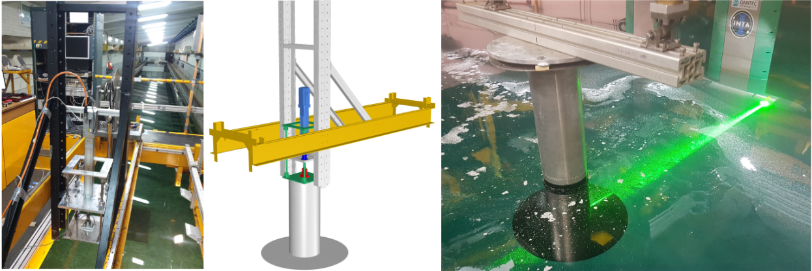
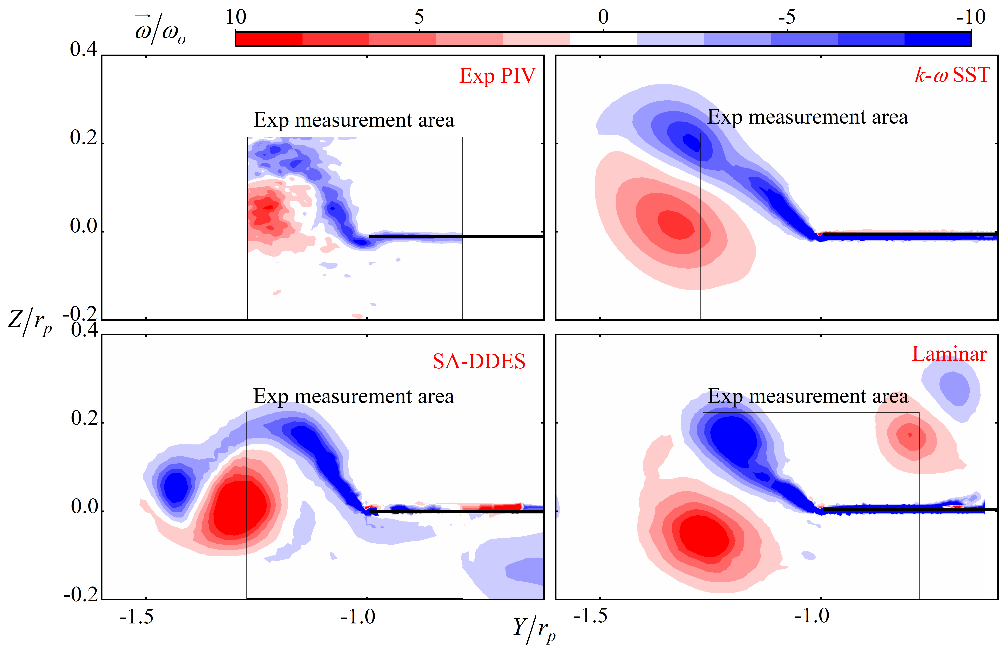
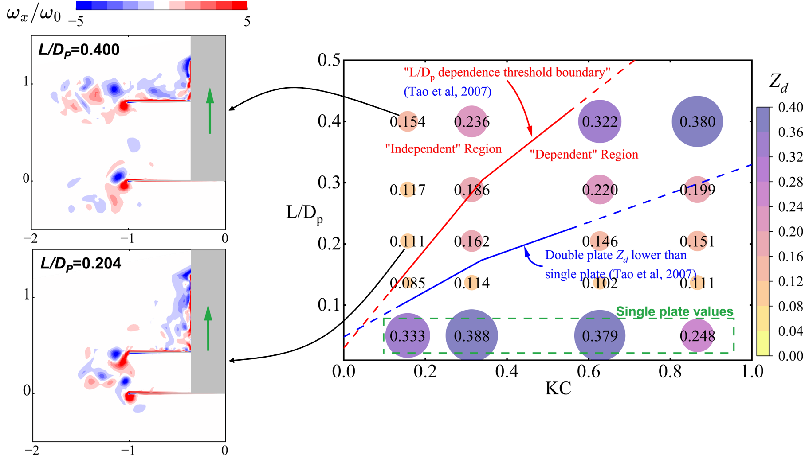
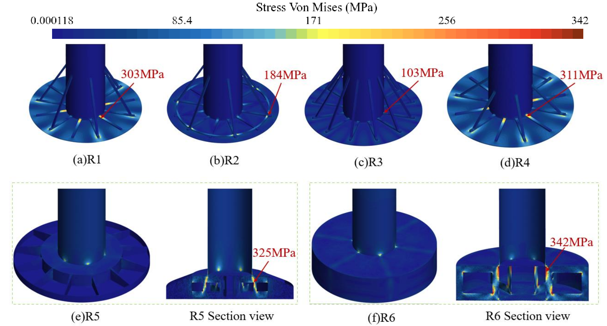

```{=html}
<main class="inner-page research-topic-page heave-plate-page">
  <a class="back-link" href="../research.html">← All research topics</a>

  <header class="page-intro">
    <p class="section-eyebrow"> </p>
    <h1>Heave Plates</h1>
  </header>

      <div class="study-visuals">
        <div class="research-figure-placeholder figure-main">
          <figure class="research-figure figure-main">
           
          </figure>
        </div>
      </div>

  <section class="heave-study" id="single-plate-cfd">
    <header class="study-header">
      <div class="study-index">Paper</div>
      <div>
        <p class="study-type">Validated CFD framework</p>
        <h2>Single heave plate forced oscillations</h2>
        <p class="study-paper-title">
          Numerical analysis of forced heave oscillations for an FOWT column
          with a heave plate using overset mesh
        </p>
        <p class="study-meta">
          <em>Ocean Engineering</em> 341, 122736 (2025)
          <span>OpenFOAM</span><span>Overset mesh</span><span>SA-DDES</span>
          <a href="https://doi.org/10.1016/j.oceaneng.2025.122736">DOI</a>
        </p>
      </div>
    </header>

    <div class="study-content">
      <div class="study-narrative">
        <div>
          <h3>Research question</h3>
          <p>Can a three-dimensional numerical method reproduce the nonlinear force and vortex dynamics of forced heave oscillations, while extending the analysis into motion regimes that are difficult to test experimentally?</p>
        </div>
        <div>
          <h3>Approach</h3>
          <p>Advanced overset-interpolation strategies were assessed in OpenFOAM, followed by validation against several force and vorticity experiments and comparison of turbulence models.</p>
        </div>
        <div>
          <h3>What the study shows</h3>
          <ul>
            <li>Improved overset interpolation reduces artificial vortex errors.</li>
            <li>SA-DDES provides the strongest agreement among the tested turbulence models.</li>
            <li>The validated model reveals abnormal nonlinear added-mass behaviour at very low KC.</li>
          </ul>
        </div>
      </div>

      <div class="study-visuals">
        <div class="research-figure-placeholder figure-main">
          <figure class="research-figure figure-main">
           
           <figcaption> Dimensionless vorticity contours between OpenFOAM and PIV experiments.</figcaption>
          </figure>
        </div>
      </div>
    </div>
  </section>

  <section class="heave-study" id="double-heave-plates">
    <header class="study-header">
      <div class="study-index">Paper</div>
      <div>
        <p class="study-type">Combined experiments and simulations</p>
        <h2>Double heave plates</h2>
        <p class="study-paper-title">
          Hydrodynamic characteristics of double heave plates: A combined
          experimental and numerical investigation
        </p>
        <p class="study-meta">
          Research manuscript
          <span>Forced oscillation</span><span>PIV</span><span>OpenFOAM</span><span>STAR-CCM+</span>
        </p>
      </div>
    </header>

    <div class="study-content">
      <div class="study-narrative">
        <div>
          <h3>Research question</h3>
          <p>When does a second plate improve added mass and damping, and when do inter-plate flow confinement and phase lag undermine the expected benefit?</p>
        </div>
        <div>
          <h3>Approach</h3>
          <p>Forced-oscillation and PIV measurements were combined with two numerical solvers while varying plate diameter, spacing ratio, KC, and non-dimensional frequency.</p>
        </div>
        <div>
          <h3>What the study shows</h3>
          <ul>
            <li>A second plate does not automatically increase added mass or damping.</li>
            <li>At high frequency, phase lag of the entrapped water produces a marked added-mass drop.</li>
            <li>Small spacing restricts vortex shedding; a practical spacing of <strong>L/D<sub>p</sub> &gt; 0.25</strong> is recommended.</li>
            <li>A larger upper plate offers the strongest overall engineering balance among the tested arrangements.</li>
          </ul>
        </div>
      </div>

      <div class="study-visuals">
        <div class="research-figure-placeholder figure-main">
          <figure class="research-figure figure-main">
           
           <figcaption> Spacing influence on the double heave plate damping performance.</figcaption>
          </figure>
        </div>
      </div>
    </div>
  </section>

  <section class="heave-study" id="reinforced-heave-plates">
    <header class="study-header">
      <div class="study-index">Paper</div>
      <div>
        <p class="study-type">Coupled FSI</p>
        <h2>Reinforcement design for single heave plates</h2>
        <p class="study-paper-title">
          Coupled hydro-structural analysis of reinforced heave plates under
          forced oscillations
        </p>
        <p class="study-meta">
          Research manuscript
          <span>STAR-CCM+</span><span>ULS / SLS</span><span>Fatigue</span>
        </p>
      </div>
    </header>

    <div class="study-content">
      <div class="study-narrative">
        <div>
          <h3>Research question</h3>
          <p>How can a thin heave plate remain structurally safe at full scale without sacrificing the vortex-driven damping that makes the device effective?</p>
        </div>
        <div>
          <h3>Approach</h3>
          <p>A validated two-way FSI framework evaluates six reinforcement strategies under an extreme forced-heave case, considering hydrodynamics, ULS, SLS, deformation, and fatigue life together.</p>
        </div>
        <div class="result-callout">
          <span>Preferred design · R3 full radial bracing</span>
          <div class="result-metrics">
            <strong>−70.1%<small>maximum stress</small></strong>
            <strong>−97.7%<small>deformation</small></strong>
            <strong>+1.8%<small>structural mass</small></strong>
            <strong>−13%<small>hydrodynamic damping</small></strong>
          </div>
          <p>R3 remains below the fatigue limit and provides the best stiffness-to-mass balance among the evaluated configurations.</p>
        </div>
      </div>

      <div class="study-visuals">
        <div class="research-figure-placeholder figure-main">
          <figure class="research-figure figure-main">
           
           <figcaption> Stress distributions at the instant of maximum stress for the six reinforced plate designs.</figcaption>
          </figure>
        </div>
      </div>
    </div>
  </section>


  <!--
  Replace each .research-figure-placeholder with a <figure class="research-figure">.
  Store images under images/research/heave-plates/ and reference them here as
  ../images/research/heave-plates/filename.jpg.
  -->
</main>
```
