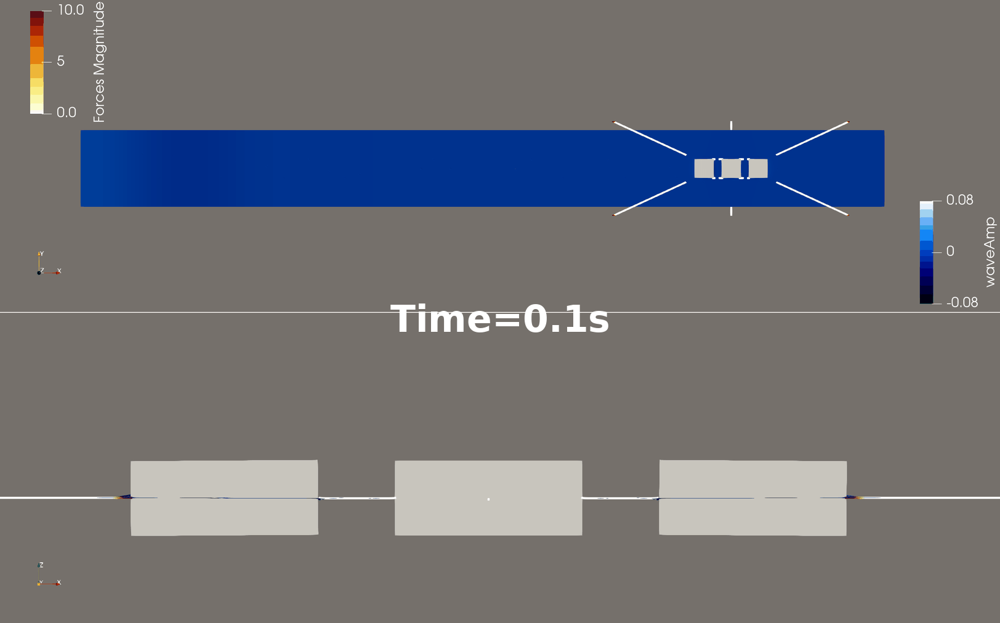

```{=html}
<main class="inner-page research-topic-page">
  <a class="back-link" href="../research.html">← All research topics</a>

  <header class="page-intro">
    <p class="section-eyebrow"> </p>
    <h1>Shared Mooring</h1>
    <p>
      Research on shared mooring systems for floating photovoltaics, floating wind, and
      co-located renewable technologies.
    </p>
  </header>

      <div class="study-visuals">
        <div class="research-figure-placeholder figure-main">
          <figure class="research-figure figure-main">
           
          </figure>
        </div>
      </div>


  <!-- Add media files under images/research/floating-renewables/. -->
</main>
```
